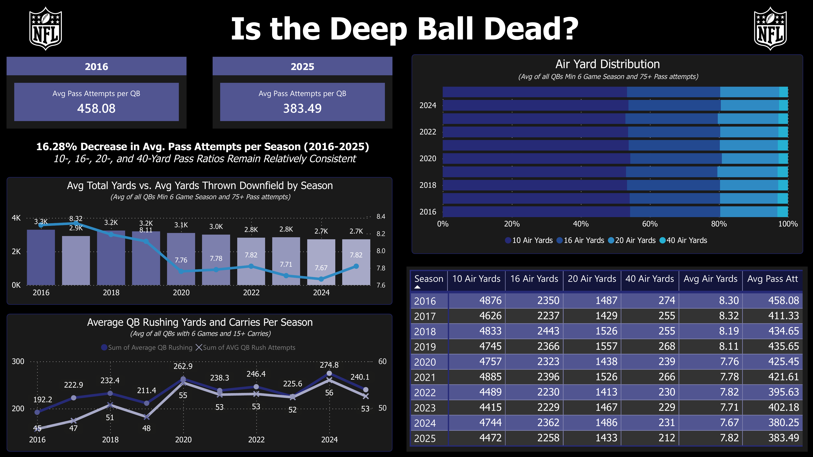
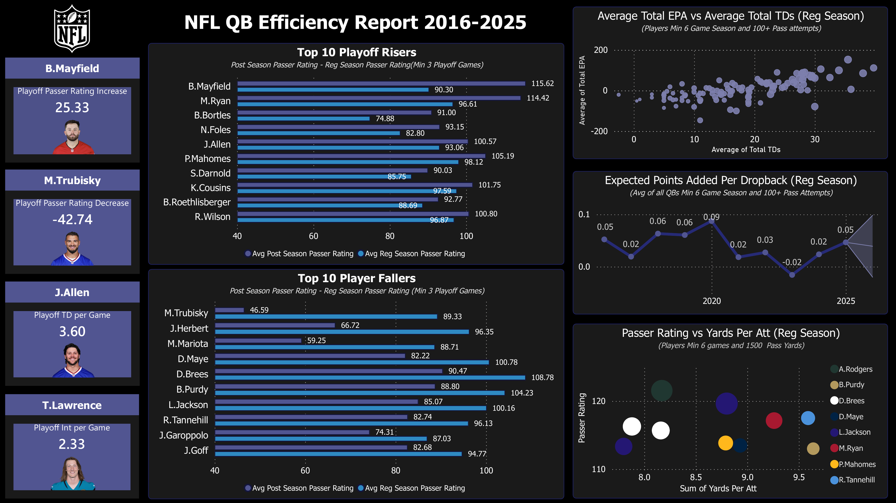
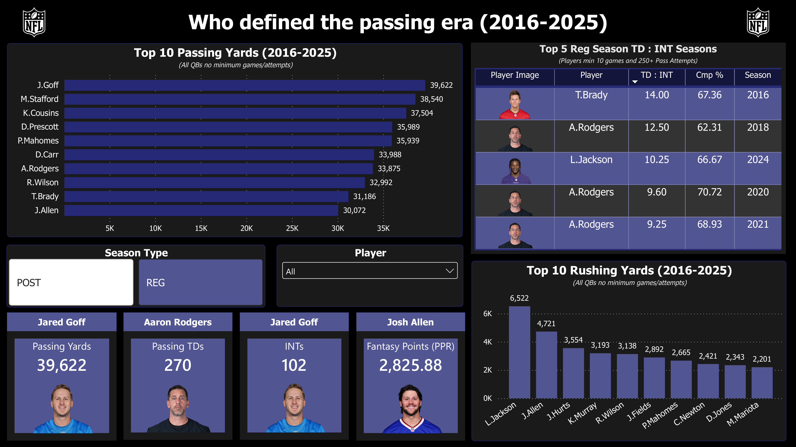

# 🏈 NFL QB Analytics Dashboard (2016–2025)

This project analyzes NFL quarterback trends and performance from 2016–2025 using Python, SQL, and Power BI. The workflow covers raw data ingestion and cleaning, storing and querying the data in PostgreSQL, and building a three-page interactive Power BI report for analysis — regular season and postseason.

All calculations and derived metrics are computed using Python or SQL. The Power BI report uses **no DAX measures or calculated columns** — every value shown is computed before it reaches the report.

## 📖 Table of Contents
- [Disclaimer](#-disclaimer)
- [Skills Demonstrated](#-skills-demonstrated)
- [Applications Used](#-applications-used)
- [Data Source](#-data-source)
- [Process of Project](#-process-of-project)
  - [1. Data Collecting & Cleaning](#1--data-collecting--cleaning-python)
  - [2. PostgreSQL](#2--postgresql)
  - [3. Excel Export](#3--connecting-to-database-and-created-one-excel-file-python)
  - [4. Power BI Dashboard](#4--power-bi-dashboard)
- [Findings](#-findings)
- [How to Reproduce](#-how-to-reproduce)
- [File Structure](#-file-structure)

## 🚨 DISCLAIMER
This project uses a third-party data source [nflverse-data (stats_player)](https://github.com/nflverse/nflverse-data/releases/tag/stats_player) Data from this source may be inaccurate or incomplete. This project is solely intended to demonstrate skills in Python, SQL, and Power BI.

## 🔧 Skills Demonstrated
- Data cleaning & feature engineering (pandas, numpy)
- Relational database design (PostgreSQL, SQL views, aggregate functions, window filters)
- BI report design without DAX — calculation logic kept in Python/SQL
- End-to-end pipeline architecture (raw data → transform → store → visualize)

## 💻 Applications Used
- **Python** — see [requirements.txt](python/requirements.txt) for needed packages (pandas, psycopg2, numpy)
- **PostgreSQL** — database and views (developed using DBeaver)
- **Power BI Desktop** — report building and visualization

## 📊 Data Source
[nflverse-data (stats_player)](https://github.com/nflverse/nflverse-data/releases/tag/stats_player)
Includes regular season and postseason statistics for all NFL Players, I have only chosen 2016–2025. This project is not affiliated with or endorsed by the NFL.

## 🧩 Process of Project

### 1. 🧹 Data Collecting & Cleaning (Python)
- Pulled raw regular season and postseason QB data from 2016-2025 seasons.
- Using pandas, filtered to QB-specific stats across the chosen seasons.
- Engineered new stat fields for each QB season, listed below.
- Cleaned nulls and handled edge cases (e.g., zero-interception seasons in ratio calculations).
- Exported the cleaned data as a CSV to import into PostgreSQL.

| Stat | Formula |
|---|---|
| Completion % | Completions / Attempts × 100 |
| TD:INT Ratio | Pass TDs / Interceptions |
| Total Turnovers | Interceptions + Fumbles Lost |
| Yards Per Attempt | Passing Yards / Pass Attempts |
| TD Per Attempt | Pass TDs / Pass Attempts |
| Air Yards Per Attempt | Passing Air Yards / Pass Attempts |
| Yards Per Rush | Rushing Yards / Rush Attempts |
| Total Yards | Passing + Rushing + Receiving Yards |
| Total TDs | Passing + Rushing + Receiving TDs |
| Total EPA | Passing EPA + Rushing EPA |
| EPA Per Dropback | Total EPA / Total Dropbacks |
| Passer Rating | Standard NFL formula |

### 2. 📝 PostgreSQL
- Created the database and [qb_data_table.sql](sql/qb_data_table.sql) table, matching the column order and types of the exported CSV.
- Imported the cleaned CSV via DBeaver's Import Data wizard.
- Created 11 views to feed the Power BI report, covering both regular season and postseason data:

| View | What It Shows |
|---|---|
| `top_25_reg_pass_yards` | Top 25 QBs by total regular season passing yards, 2016–2025 |
| `avg_yards_reg_season` | Average passing stats per regular season (min. 6 games, 75+ attempts) |
| `top_25_reg_passer_rating` | Top 25 single-season passer ratings (min. 6 games, 1,500+ yards) |
| `avg_yds_thrown_downfield_reg` | Average air yards per attempt by season, plus air yard distribution |
| `top_25_reg_total_yards` | Top 25 QBs by total yards (passing + rushing), 2016–2025 |
| `avg_qb_rush_reg_yards_season` | Average QB rushing stats per season (min. 6 games, 20+ carries) |
| `best_td_int_per_reg_season` | Best single-season TD:INT ratios (min. 10 games, 250+ attempts) |
| `top_playoff_performers` | Top 25 QBs by total playoff passing yards |
| `combined_reg_post_stats` | Regular season + postseason stats combined per player |
| `reg_vs_post_game_avg` | Per-game regular season vs. postseason performance comparison (min. 3 playoff games) |
| `epa_vs_tds_scored` | EPA and dropback efficiency vs. touchdowns scored by season |

### 3. 🐍 Connecting to Database and Created One Excel File (Python)
- Connected to the postgre server using (creating the connection using pyscopg2).
- Created a blank excel file in which I looped over each of the views, making each its own separate page.
### Setup Notes
- Before running [qb_data.ipynb](python/qb_data.ipynb), update the PostgreSQL connection details (host, database, user, password) to match your local environment — see inline comments in the connection cell.

### 4. 📈 Power BI Dashboard
- Connected Power BI directly to the Excel workbook created in the previous step, with each sheet mapped to its corresponding view.
- Built a three-page report, all calculations pre-computed in Python/SQL — no DAX used.

**Page 1 — Game Development**
League-wide trend page. Tracks how the passing game has evolved from 2016–2025: average pass attempts, air yard distribution, and QB rushing trends over time.



**Page 2 —QB Efficiency**
Player-level efficiency page. Passer rating vs. yards-per-attempt, EPA vs. touchdowns, and season-over-season playoff risers/fallers.



**Page 3 — QB Statistics**
Interactive leaderboard page. Top passing/rushing yardage, TD:INT ratio rankings, and a player slicer for exploration.



## 🔍 Findings

**1. Pass attempts are declining, but pass depth distribution has stayed consistent.**
Average pass attempts per QB fell 16.28% from 2016 to 2025. Despite this, the share of throws at each depth tier (10-, 16-, 20-, and 40-yard air yards) has remained relatively stable across the same period — the passing game has gotten less frequent, not necessarily shorter in shape. Rushing attempts and rushing yards by QBs have slowly increased over this time period while the Avg Passing Yards and Avg Yards Thrown Downfield per Season has slowly decreased.

**2. Most QBs See a Decline in Passer Rating During the Playoffs**

Baker Mayfield had the largest increase in passer rating, with a 25.33 point increase from the regular season to the playoffs, while Mitchell Trubisky had the largest decline at -42.74 points. Overall, the majority of QBs in the dataset had a lower passer rating during the playoffs, with only a smaller group improving. This could be influenced by the higher level of competition and defenses faced during the postseason.

**3. EPA and Touchdowns Show a Strong Relationship**

Total EPA and total touchdowns show a strong positive relationship across QBs, suggesting that quarterbacks who produce more efficient plays also tend to score more touchdowns. League-wide EPA per dropback declined after 2020 before increasing again in the most recent season, showing a potential shift in overall offensive efficiency.

**4. TD:INT Efficiency Shows Both Peak and Sustained Performance**

Tom Brady recorded the highest single-season TD:INT ratio at 14.00 among qualifying quarterbacks. However, Aaron Rodgers appeared three times in the top five of the rankings, showing that strong ball security and touchdown production can be sustained over multiple seasons rather than being the result of one standout year.

**5. Lamar Jackson Stands Out in QB Rushing Production**

Lamar Jackson leads all quarterbacks in total rushing yards from 2016–2025 by a significant margin, finishing with 1,800 more rushing yards than the next closest quarterback. His production highlights how the role of the quarterback has continued to expand beyond passing, especially as mobile quarterbacks have become a larger part of NFL offenses.

**6. High Passing Volume Can Also Lead to More Turnovers**

Jared Goff leads the league in total passing yards during the 2016–2025 period with 39,622 yards, but he also leads in total interceptions with 102. This shows how raw counting statistics can be influenced by opportunity, durability, and volume, and why passing production should be viewed alongside efficiency and turnover statistics.

## 🚀 How to Reproduce
1. Clone this repo
2. `pip install -r python/requirements.txt`
3. Update PostgreSQL credentials in [qb_data.ipynb](python/qb_data.ipynb)
4. Run the data cleaning portion of [qb_data.ipynb](python/qb_data.ipynb) to generate the cleaned CSV
5. Run [qb_data_table.sql](sql/qb_data_table.sql) to create the table
6. Import the cleaned CSV into the table using DBeaver's Import Data wizard
7. Run [qb_data_views.sql](sql/qb_data_views.sql) to create the 11 views
8. Run the psycopg2 portion of [qb_data.ipynb](python/qb_data.ipynb) to generate the Excel workbook
9. Open [qb_report.pbix](power_bi/qb_report.pbix) in Power BI Desktop

## 📁 File Structure

```
├── analysis_ready_data/
│   ├── qb_data_views.xlsx   # Excel file containing all of the views
├── cleandata/
│   ├── cleaned_qb_stats.csv # CSV file created only grabbing the QB position and stats desired
├── images/
│   ├── qb_report_page1.png  # Screenshots of PowerBI Dashboards
│   ├── qb_report_page2.png
│   ├── qb_report_page3.png 
├── power_bi/
│   ├── qb_report.pbix       # Final three-page Power BI report
├── python/
│   ├── qb_data.ipynb        # Main Python notebook (cleaning + feature engineering + export)
|   ├── requirements.txt     # Modules required to replicate Python code
├── rawdata/
|   ├── post_season
|        ├── stats_player_post_[year].csv  # Data downloaded (can alter to any year range)
|   ├── regular_season
|        ├── stats_player_reg_[year].csv   # Data downloaded (can alter to any year range)
├── sql/
│   ├── qb_data_table.sql    # PostgreSQL table creation script
│   ├── qb_data_views.sql    # All 11 SQL views
└── README.md
```
